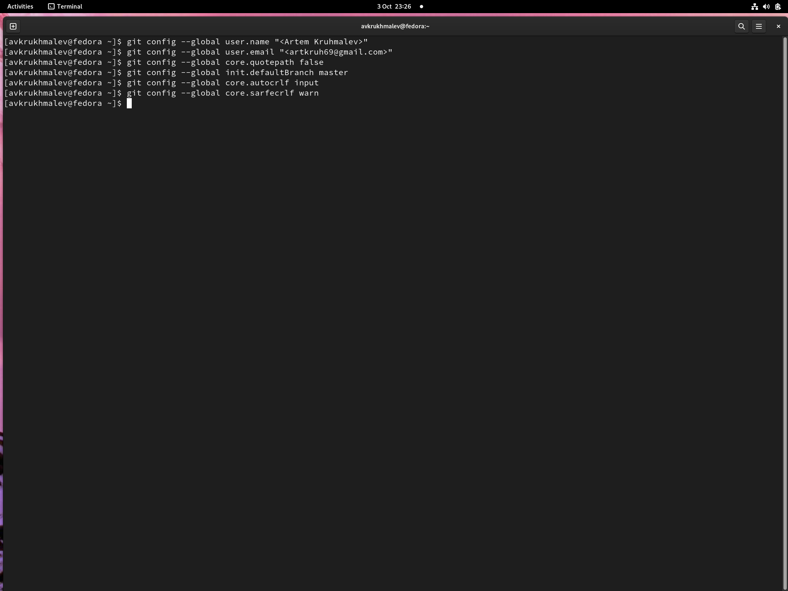
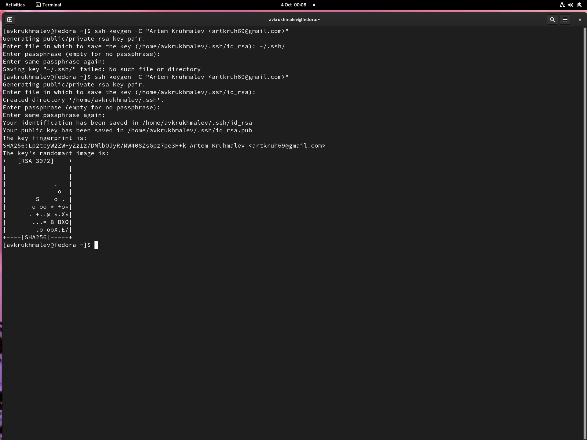
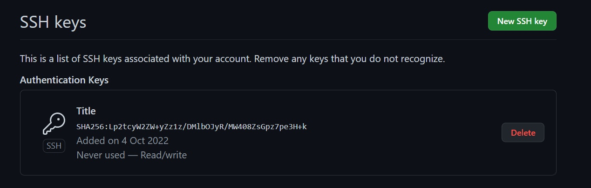
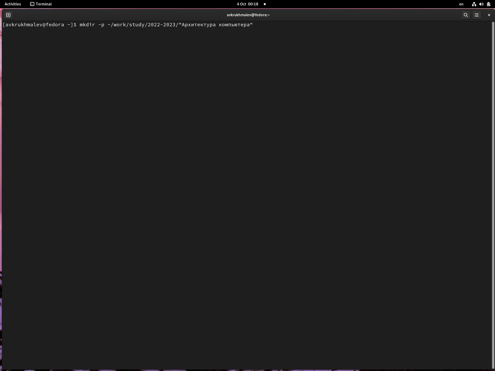
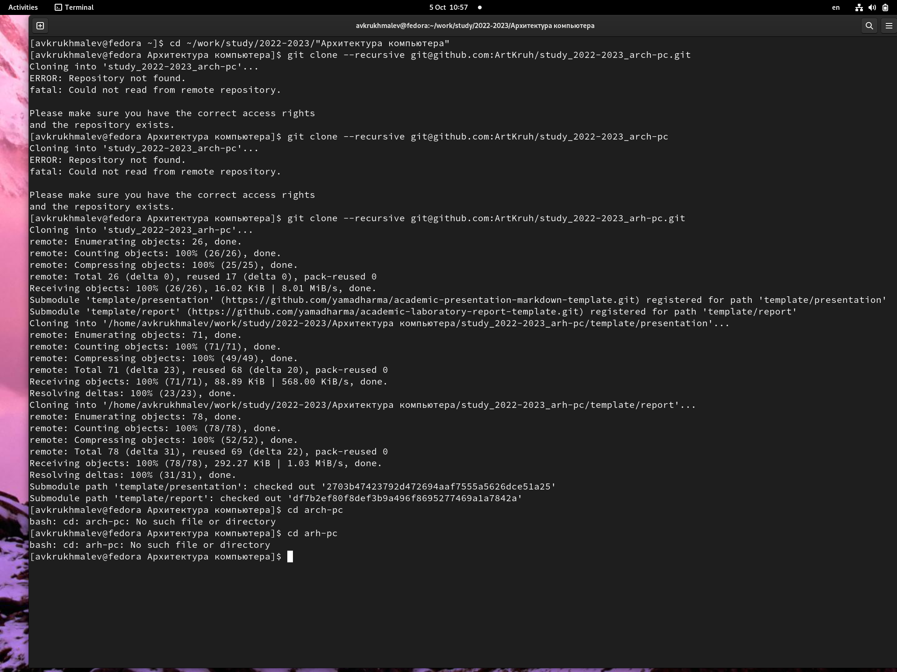
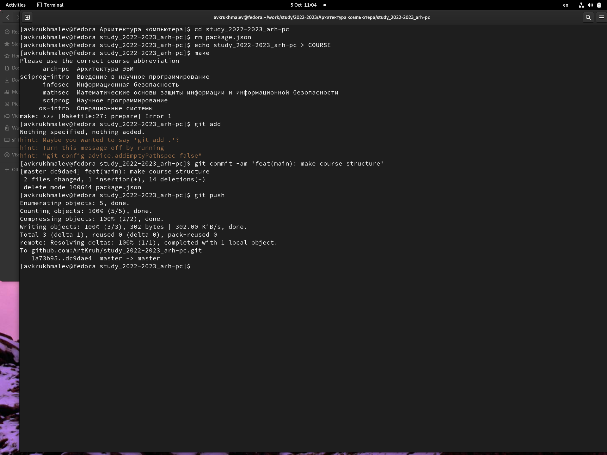
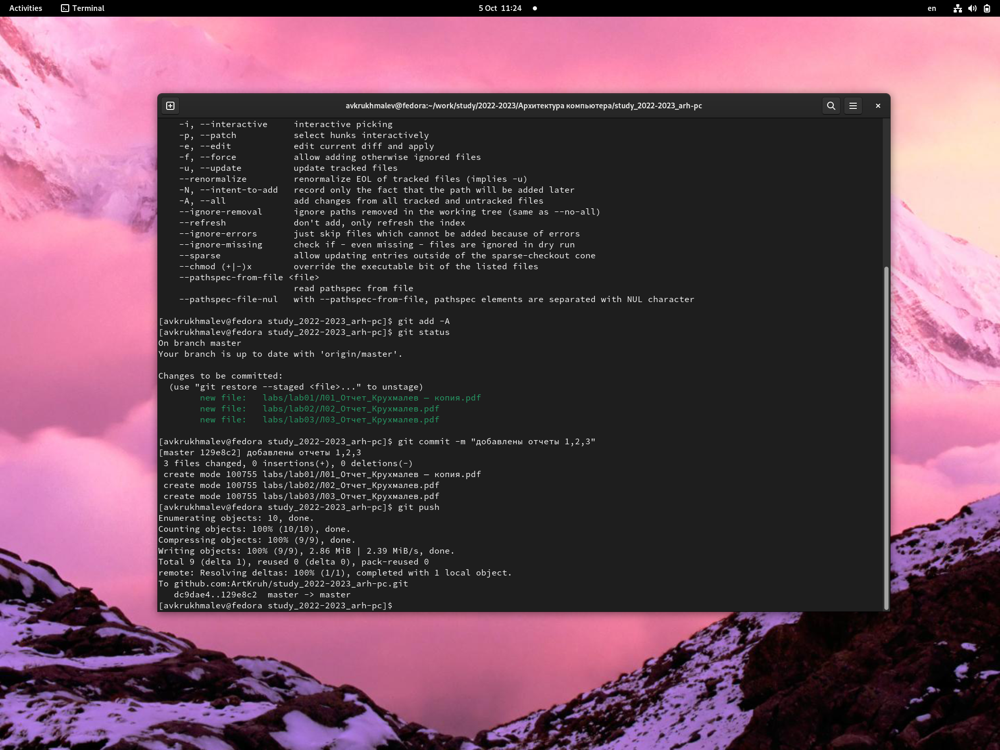

---
## Front matter
title: "ОТЧЕТ ПО ЛАБОРАТОРНОЙ РАБОТЕ №3"
subtitle: "НММ-бд-02-22"
author: "Крухмалев Артём Владиславович"

## Generic otions
lang: ru-RU
toc-title: "Содержание"

## Bibliography
bibliography: bib/cite.bib
csl: pandoc/csl/gost-r-7-0-5-2008-numeric.csl

## Pdf output format
toc: true # Table of contents
toc-depth: 2
lof: true # List of figures
lot: true # List of tables
fontsize: 12pt
linestretch: 1.5
papersize: a4
documentclass: scrreprt
## I18n polyglossia
polyglossia-lang:
  name: russian
  options:
	- spelling=modern
	- babelshorthands=true
polyglossia-otherlangs:
  name: english
## I18n babel
babel-lang: russian
babel-otherlangs: english
## Fonts
mainfont: PT Serif
romanfont: PT Serif
sansfont: PT Sans
monofont: PT Mono
mainfontoptions: Ligatures=TeX
romanfontoptions: Ligatures=TeX
sansfontoptions: Ligatures=TeX,Scale=MatchLowercase
monofontoptions: Scale=MatchLowercase,Scale=0.9
## Biblatex
biblatex: false
biblio-style: "gost-numeric"
biblatexoptions:
  - parentracker=true
  - backend=biber
  - hyperref=auto
  - language=auto
  - autolang=other*
  - citestyle=gost-numeric
## Pandoc-crossref LaTeX customization
figureTitle: "Рис."
tableTitle: "Таблица"
listingTitle: "Листинг"
## Misc options
indent: true
header-includes:
  - \usepackage{indentfirst}
  - \usepackage{float} # keep figures where there are in the text
  - \floatplacement{figure}{H} # keep figures where there are in the text
---

# Цель работы

Познакомиться с системой git, а также сайтом github.  

# Задание

Настроить GitHub, создать репозиторий и каталог курса. 

# Выполнение лабораторной работы
1. Создадим профиль на github  
2. Настроим git

{ #fig:001 width=70% }

3. Создадим SSH ключ и внесем его в github

{ #fig:002 width=70% }

{ #fig:003 width=70% }

4. Создадим репозиторий

{ #fig:004 width=70% }

5. Найдем нужный репозиторий на github и скопируем его в свой профиль, затем скопируем SSH ключ
6. Склонируем репозиторий

{ #fig:005 width=70% }

{ #fig:006 width=70% }

# Выполнение самостоятельной работы 
1. Добавим отчет в каталог рабочего пространства. Для этого воспользуемся общей папкой 
2. Добавим все работы в github 

{ #fig:007 width=70% }

# Выводы

В данной лабораторной работе мы познакомились с github и каталогами, провели их настройку. Добавили прошлые работы в каталоге с помощью терминала.  

# Список литературы{.unnumbered}

::: {#refs}
:::
