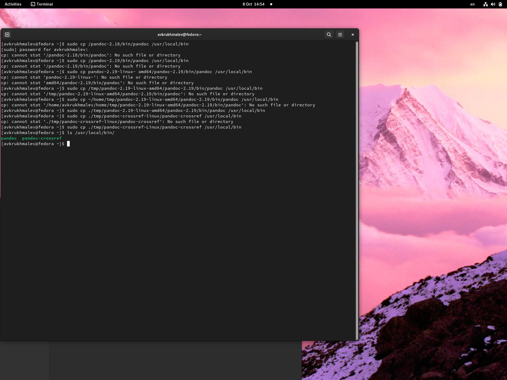
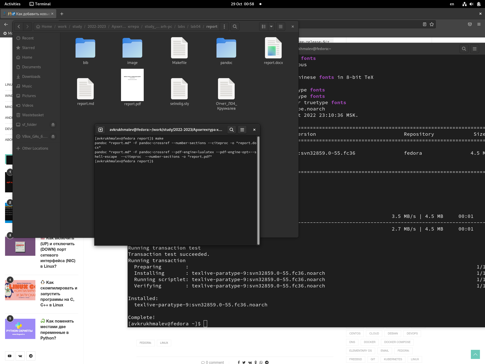
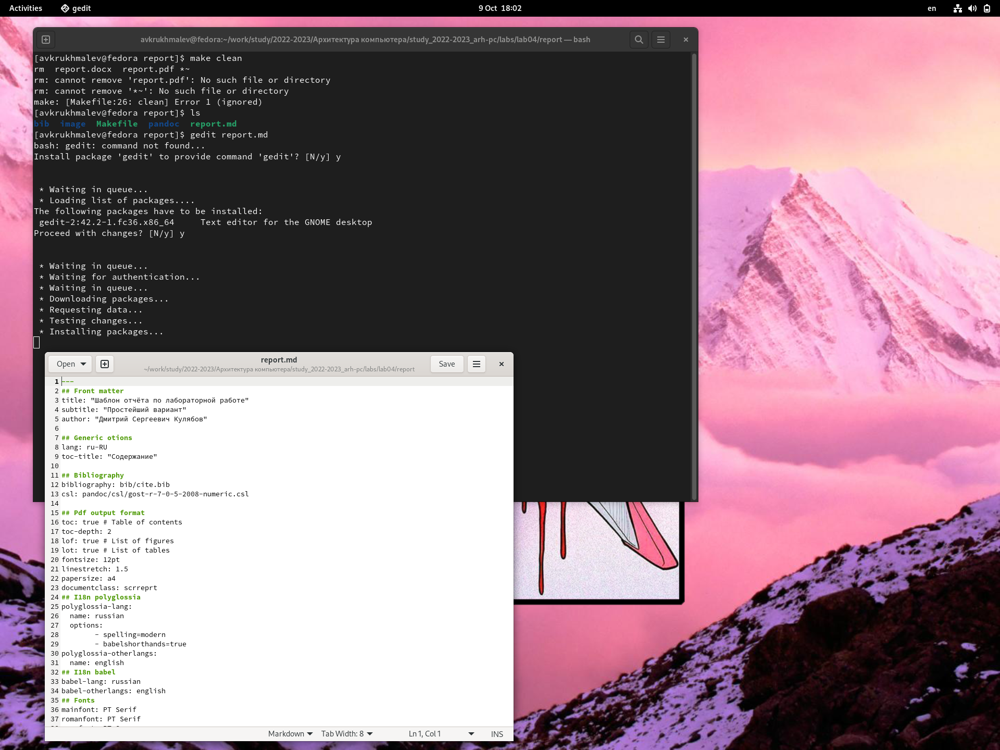
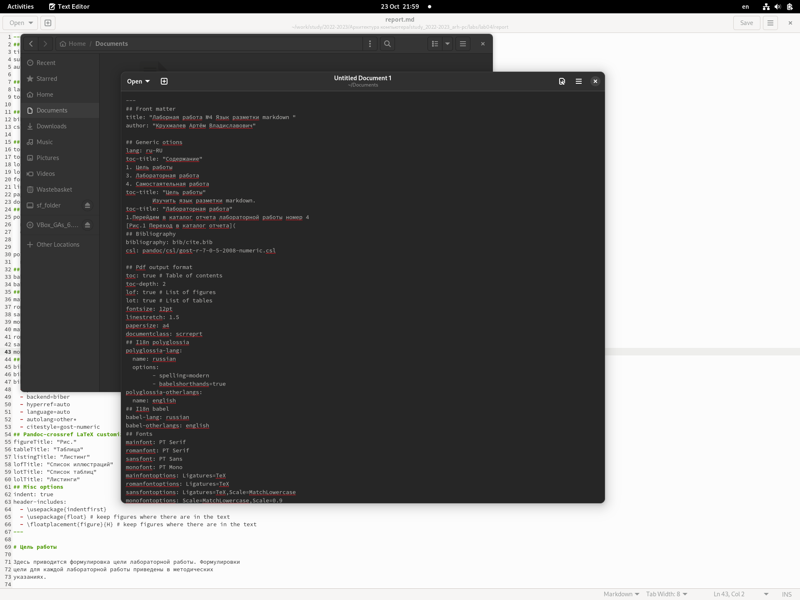
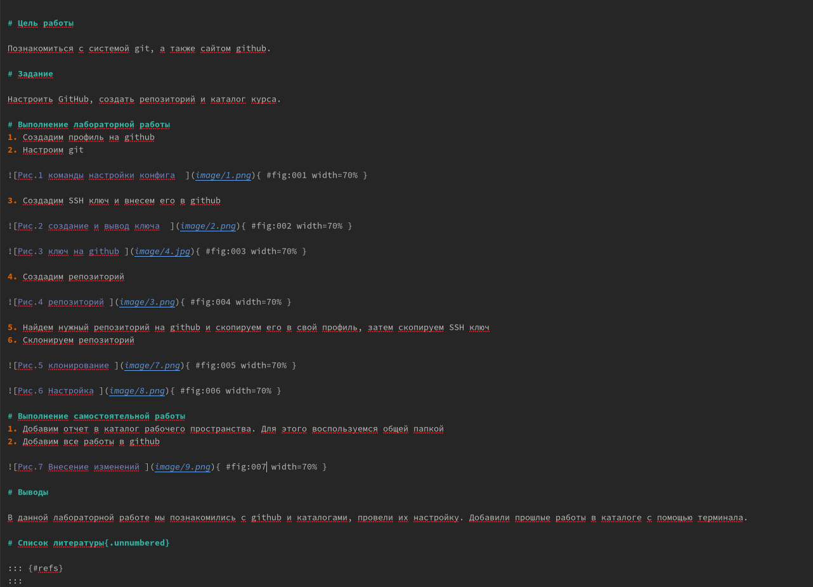

---
## Front matter
title: "Лаборная работа №4 Язык разметки markdown "
subtitle: "НММ-бд-02-22"
author: "Крухмалев Артём Владиславович"

## Generic otions
lang: ru-RU
toc-title: "Содержание"

## Bibliography
bibliography: bib/cite.bib
csl: pandoc/csl/gost-r-7-0-5-2008-numeric.csl

## Pdf output format
toc: true # Table of contents
toc-depth: 2
lof: true # List of figures
lot: true # List of tables
fontsize: 12pt
linestretch: 1.5
papersize: a4
documentclass: scrreprt
## I18n polyglossia
polyglossia-lang:
  name: russian
  options:
	- spelling=modern
	- babelshorthands=true
polyglossia-otherlangs:
  name: english
## I18n babel
babel-lang: russian
babel-otherlangs: english
## Fonts
mainfont: PT Serif
romanfont: PT Serif
sansfont: PT Sans
monofont: PT Mono
mainfontoptions: Ligatures=TeX
romanfontoptions: Ligatures=TeX
sansfontoptions: Ligatures=TeX,Scale=MatchLowercase
monofontoptions: Scale=MatchLowercase,Scale=0.9
## Biblatex
biblatex: false
biblio-style: "gost-numeric"
biblatexoptions:
  - parentracker=true
  - backend=biber
  - hyperref=auto
  - language=auto
  - autolang=other*
  - citestyle=gost-numeric
## Pandoc-crossref LaTeX customization
figureTitle: "Рис."
tableTitle: "Таблица"
listingTitle: "Листинг"
lofTitle: "Список иллюстраций"
lotTitle: "Список таблиц"
lolTitle: "Листинги"
## Misc options
indent: true
header-includes:
  - \usepackage{indentfirst}
  - \usepackage{float} # keep figures where there are in the text
  - \floatplacement{figure}{H} # keep figures where there are in the text
---

# Цель работы

Изучить язык разметки markdown. 

# Задание

Сделать лабораторную работу в markdown 

# Выполнение лабораторной работы
1. Установим TexLive, pandoc, pandoc-crossref

{ #fig:001 width=70% }

2. Перейдем в каталог отчета лабораторной работы номер 4 
В терминале пропишем команду make 

{ #fig:002 width=70% }

3. Создались файлы в формате docx и pdf, c помощью команды make clean удалим их.

{ #fig:003 width=70% }

4. С помощью команды gedit откроем файл report.md

{ #fig:004 width=70% }

5. Загрузим файл на github

# Выполнение самостоятельной работы 
1. Выполним отчет по 3 лабораторной работе в markdown 

{ #fig:005 width=70% }

2. Добавим все файлы на github 

# Выводы

В данной лабораторной работе мы познакомились с программой markdown. С помощью неё научились делать отчеты. NFr

# Список литературы{.unnumbered}

::: {#refs}
:::
