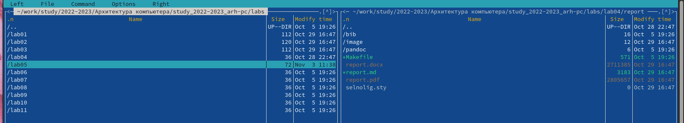
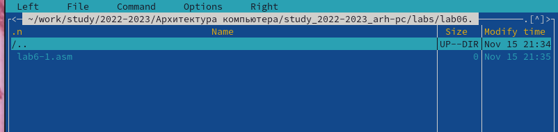
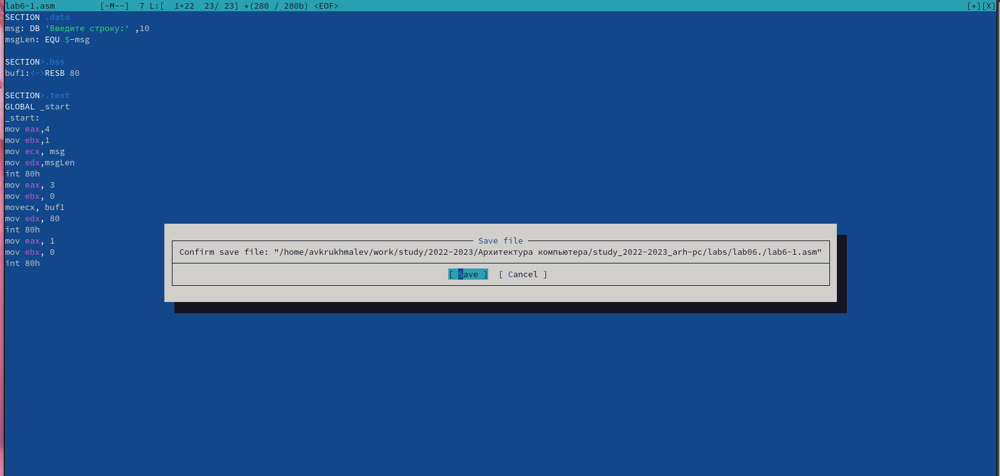
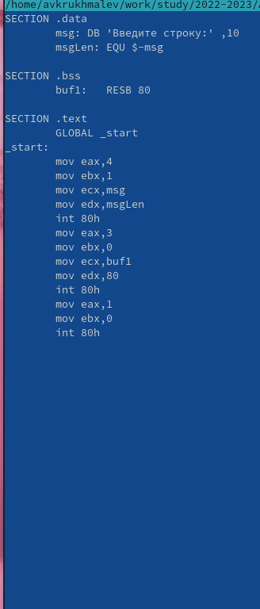
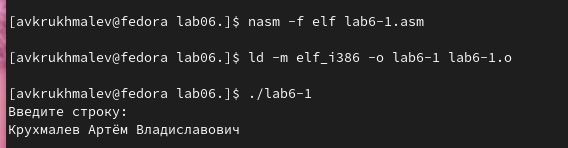
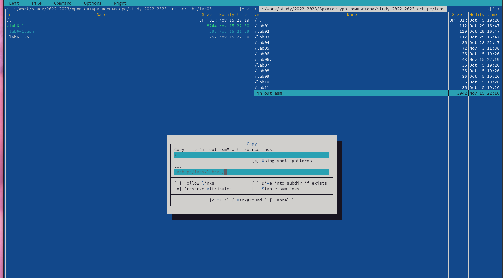
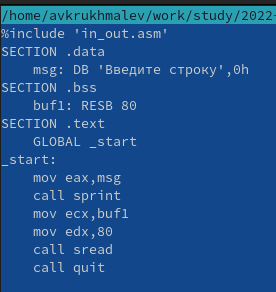
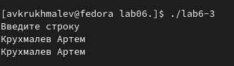
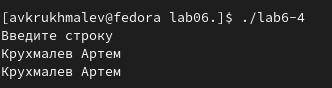
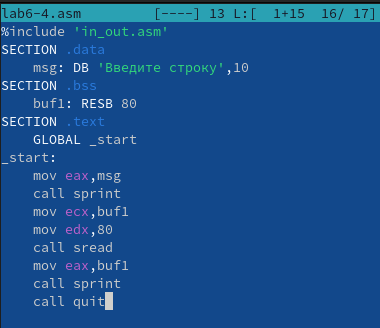

---
## Front matter
title: "Лаборная работа №6 Основы работы с Midnight Comander"
subtitle: "НММ-бд-02-22"
author: "Крухмалев Артём Владиславович"

## Generic otions
lang: ru-RU
toc-title: "Содержание"

## Bibliography
bibliography: bib/cite.bib
csl: pandoc/csl/gost-r-7-0-5-2008-numeric.csl

## Pdf output format
toc: true # Table of contents
toc-depth: 2
lof: true # List of figures
lot: true # List of tables
fontsize: 12pt
linestretch: 1.5
papersize: a4
documentclass: scrreprt
## I18n polyglossia
polyglossia-lang:
  name: russian
  options:
	- spelling=modern
	- babelshorthands=true
polyglossia-otherlangs:
  name: english
## I18n babel
babel-lang: russian
babel-otherlangs: english
## Fonts
mainfont: PT Serif
romanfont: PT Serif
sansfont: PT Sans
monofont: PT Mono
mainfontoptions: Ligatures=TeX
romanfontoptions: Ligatures=TeX
sansfontoptions: Ligatures=TeX,Scale=MatchLowercase
monofontoptions: Scale=MatchLowercase,Scale=0.9
## Biblatex
biblatex: false
biblio-style: "gost-numeric"
biblatexoptions:
  - parentracker=true
  - backend=biber
  - hyperref=auto
  - language=auto
  - autolang=other*
  - citestyle=gost-numeric
## Pandoc-crossref LaTeX customization
figureTitle: "Рис."
lofTitle: "Список иллюстраций"
## Misc options
indent: true
header-includes:
  - \usepackage{indentfirst}
  - \usepackage{float} # keep figures where there are in the text
  - \floatplacement{figure}{H} # keep figures where there are in the text
---
# Цель работы

Научиться работать с программой Midnight Comander, изучить синтаксис программ на асемблере

# Задание

Написать программы вывода на асемблере, с помощью mc перенести их.

# Выполнение лабораторной работы

1. С помощью терминала откроем мс и создадим новую папку 

{ #fig:001 width=70% }

2. C помощью команды touch создадим новый файл 

{ #fig:002 width=70% }

3. Теперь с помощью клавиши f4 откроем файл и напишем в нем программу

{ #fig:003 width=70% }

4. С помощью f3 проверим написанный код

{ #fig:004 width=70% }

5. Создадим рабочий файл с помощью nasm и проверим его работу

{ #fig:005 width=70% }

6. Теперь добавим файл in_out.asm с помощью мс 

{ #fig:006 width=70% }

7. Изменим файл с помощью добавленого файла 

{ #fig:007 width=70% }

8. Скомпилируем и выведем файлы с использованием sprint и sprintLF. Sprint выводит на этой же строке, SprintLF на следующей строке

# Выполнение самостоятельной работы 

1. Скопируем файл lab6-1.asm и добавим вывод текста, откомпилируем его и выведем

{ #fig:008 width=70% }

2. Ещё раз скопируем файл и с использованием in_out.asm переделаем программу

{ #fig:009 width=70% }

{ #fig:010 width=70% }

# Выводы

Мы научились работать с midnight commander, написали программу по выводу строк и использовали файл для её упрощения

