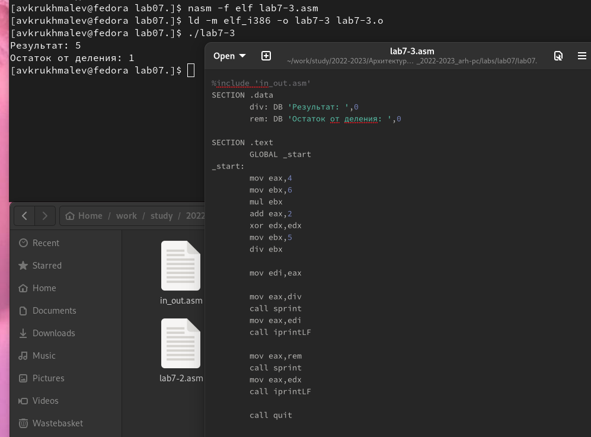

---
## Front matter
title: "Лаборная работа №7 Арифметическме операции в NASM"
subtitle: "НММ-бд-02-22"
author: "Крухмалев Артём Владиславович"

## Generic otions
lang: ru-RU
toc-title: "Содержание"

## Bibliography
bibliography: bib/cite.bib
csl: pandoc/csl/gost-r-7-0-5-2008-numeric.csl

## Pdf output format
toc: true # Table of contents
toc-depth: 2
fontsize: 12pt
linestretch: 1.5
papersize: a4
documentclass: scrreprt
## I18n polyglossia
polyglossia-lang:
  name: russian
  options:
	- spelling=modern
	- babelshorthands=true
polyglossia-otherlangs:
  name: english
## I18n babel
babel-lang: russian
babel-otherlangs: english
## Fonts
mainfont: PT Serif
romanfont: PT Serif
sansfont: PT Sans
monofont: PT Mono
mainfontoptions: Ligatures=TeX
romanfontoptions: Ligatures=TeX
sansfontoptions: Ligatures=TeX,Scale=MatchLowercase
monofontoptions: Scale=MatchLowercase,Scale=0.9
## Biblatex
biblatex: false
biblio-style: "gost-numeric"
biblatexoptions:
  - parentracker=true
  - backend=biber
  - hyperref=auto
  - language=auto
  - autolang=other*
  - citestyle=gost-numeric
## Pandoc-crossref LaTeX customization
figureTitle: "Рис."
tableTitle: "Таблица"
listingTitle: "Листинг"
lofTitle: "Список иллюстраций"
lotTitle: "Список таблиц"
lolTitle: "Листинги"
## Misc options
indent: true
header-includes:
  - \usepackage{indentfirst}
  - \usepackage{float} # keep figures where there are in the text
  - \floatplacement{figure}{H} # keep figures where there are in the text
---

# Цель работы

Научиться работать с арифмитическими операциями

# Задание

Написать программу для вычисления предложенной функции

# Выполнение лабораторной работы

1. С помощью терминала создадим подкаталог

{ #fig:001 width=70% }

2. Напишем программу для вычисления суммы заданных переменных 

{ #fig:002 width=70% }

3. Создадим файл программы 

{ #fig:003 width=70% }

4. Запустим программу, заметим, что вывелось не число, а буква j

{ #fig:004 width=70% }

5. Изменим программу и посмотрим, что изменится, заметим, что символ соответствующий 10 не выводится терминалом. 10 соответствует символы LF, /n

{ #fig:005 width=70% }

6. Создадим следующий файл, скомпилируем его и посмотрим, что он выведет-106, сумма кодов символов 

{ #fig:006 width=70% }

7. Изменим программу, выведем ответ с помощью iprintLF и iprint. Отличие в выводе на следубщей или на этой же строке 

{ #fig:007 width=70% }

{ #fig:008 width=70% }

8. Создадим следующий файл по вычислению обычной функции без неизвестных. 

{ #fig:009 width=70% }

{ #fig:010 width=70% }

10. Создадим новый файл и узнаем вариант самостоятельной работы

{ #fig:011 width=70% }

11. 
1.С помощью следующих строк выводится надпись "Ваш вариант" 
mov eax,rem
call sprint
mov eax,edx
call iprintLF
2.Для записи x с клавиатуры и вывода сообщения для этого
3.Для того чтобы преобразовать код символа в нужное нам число 
4.Данные строки отвечают за просчет варианта
xor edx,edx
mov ebx,20
div ebx
inc edx
5.В edx 
6.inc пребавляет единицу 
7.Данные строки отвечают за вывод текста
mov eax,rem
call sprint
mov eax,edx
call iprintLF

# Самостоятельная работа

1.Мне попался 1 вариант, напишем код и выведем результат 

{ #fig:012 width=70% }

# Выводы

В данной работе мы познакомились с операторами для вычислений, а также написали программу для вычисления с неизвестной 

