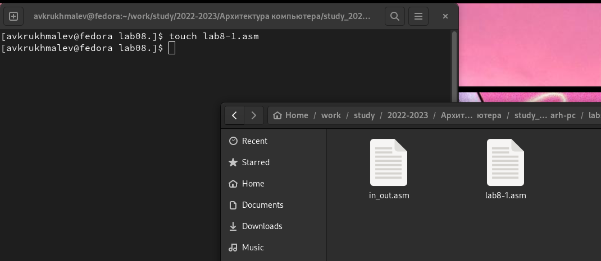
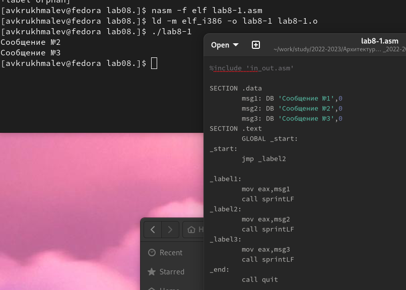
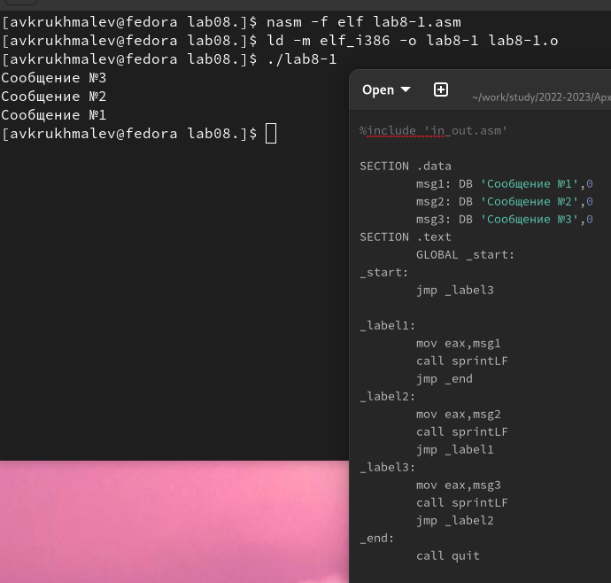
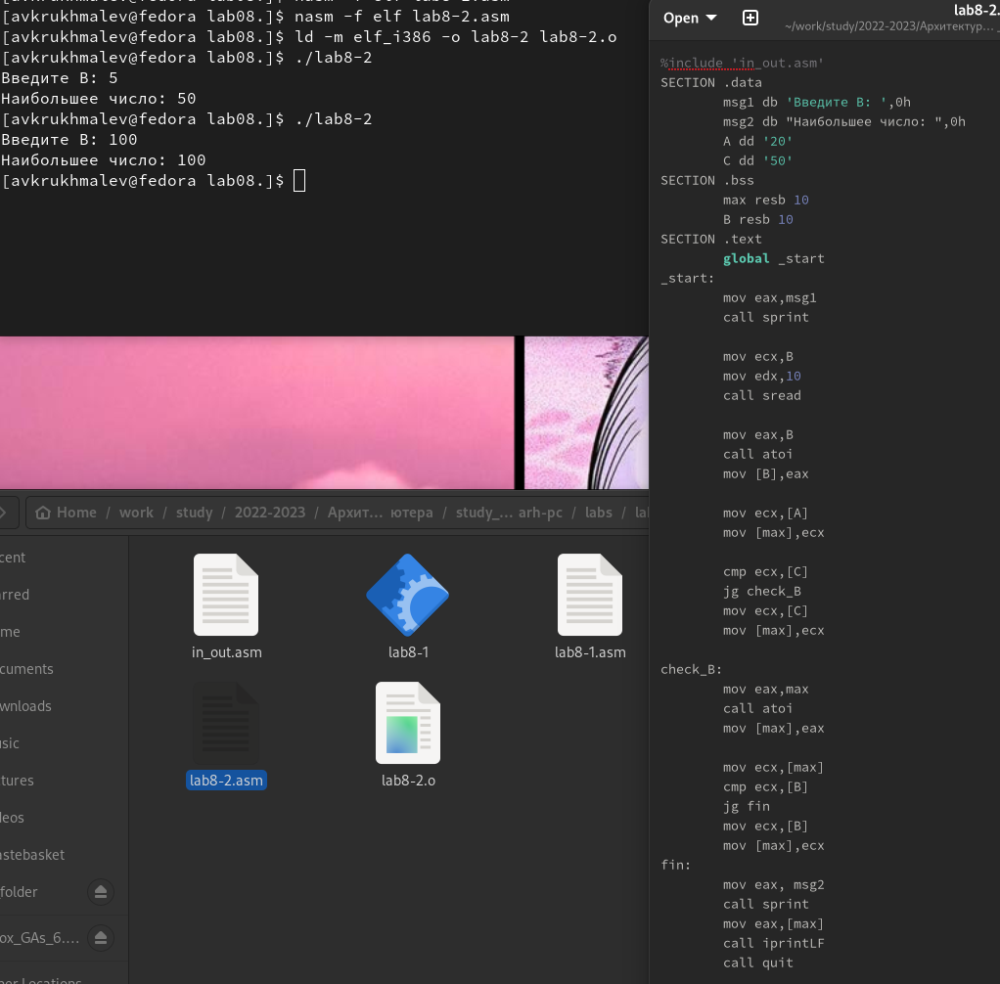
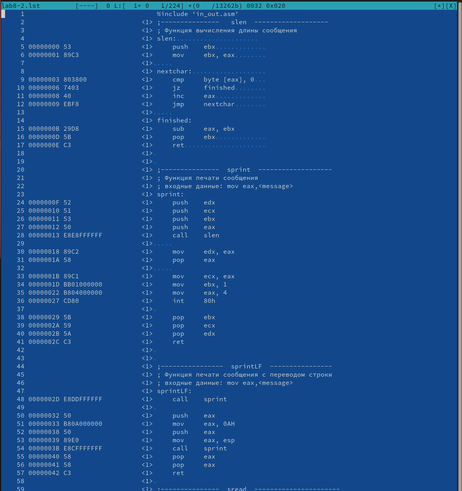
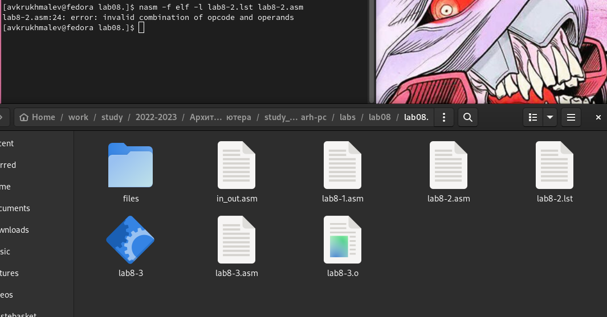
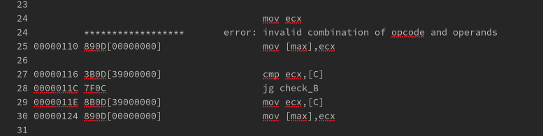
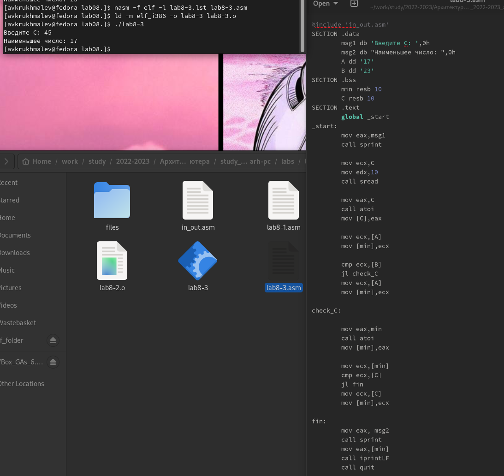
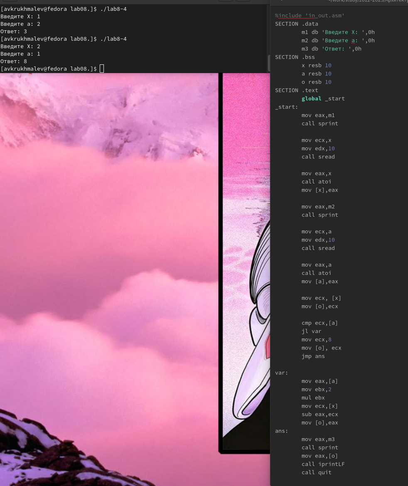

---
## Front matter
title: "Лаборная работа №8 Команды
безусловного и условного переходов в
Nasm. Программирование ветвлений."
subtitle: "НММ-бд-02-22"
author: "Крухмалев Артём Владиславович"

## Generic otions
lang: ru-RU
toc-title: "Содержание"

## Bibliography
bibliography: bib/cite.bib
csl: pandoc/csl/gost-r-7-0-5-2008-numeric.csl

## Pdf output format
toc: true # Table of contents
toc-depth: 2
fontsize: 12pt
linestretch: 1.5
papersize: a4
documentclass: scrreprt
## I18n polyglossia
polyglossia-lang:
  name: russian
  options:
	- spelling=modern
	- babelshorthands=true
polyglossia-otherlangs:
  name: english
## I18n babel
babel-lang: russian
babel-otherlangs: english
## Fonts
mainfont: PT Serif
romanfont: PT Serif
sansfont: PT Sans
monofont: PT Mono
mainfontoptions: Ligatures=TeX
romanfontoptions: Ligatures=TeX
sansfontoptions: Ligatures=TeX,Scale=MatchLowercase
monofontoptions: Scale=MatchLowercase,Scale=0.9
## Biblatex
biblatex: false
biblio-style: "gost-numeric"
biblatexoptions:
  - parentracker=true
  - backend=biber
  - hyperref=auto
  - language=auto
  - autolang=other*
  - citestyle=gost-numeric
## Pandoc-crossref LaTeX customization
figureTitle: "Рис."
tableTitle: "Таблица"
listingTitle: "Листинг"
lofTitle: "Список иллюстраций"
lotTitle: "Список таблиц"
lolTitle: "Листинги"
## Misc options
indent: true
header-includes:
  - \usepackage{indentfirst}
  - \usepackage{float} # keep figures where there are in the text
  - \floatplacement{figure}{H} # keep figures where there are in the text
---

# Цель работы

Изучить команды условного и безусловного перехода, познакомиться с программой ветвлений

# Задание

Написать программу с использованием ветвлений

# Выполнение лабораторной работы

1. С помощью терминала создадим подкаталог, создадим файл lab8-1.asm

{ #fig:001 width=70% }

2.Изучим и запишем в него код из листинга, откомпилируем и запустим файд 

{ #fig:002 width=70% }

3. Изменим код программы и посмотрим, что он нам выведет

{ #fig:003 width=70% }

4. Создадим новый файл, запишим в него предложенный код, предварительно изучив его, посмотрим, что он выводит нам при разных значениях

{ #fig:004 width=70% }

5. С помощью команды nasm -f elf -l lab8-2.lst lab8-2.asm создадим файл листинга. 

000000F2(строка на 16 месте-это её адрес);  B90A000000 (машинный код); mov ecx,C (в регистр еах вносим значение С)
000000F7 (строка на 17 месте-это её адрес); BA0A000000 (машинный код); mov edx,10 (в регистр еах вносим значение 10)
000000FC (строка на 18месте-это её адрес); E842FFFFFF (машинный код); call sread (Функция считывания сообщения)
    
{ #fig:005 width=70% }

6. Изменим код, как видим выводится ошибка, также в листинге в строке 24 она пишется.

{ #fig:006 width=70% }

{ #fig:007 width=70% }

# Самостоятельная работа

1. Мне попался 1 вариант, напишем код и выведем результат 

{ #fig:008 width=70% }

2. Сделаем 2-ю задачу

{ #fig:009 width=70% }

# Выводы

В данной работе мы познакомились с безусловным и условным переходом, написали программы с использованием ветвления 

